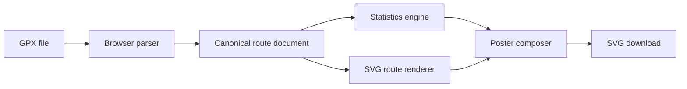

# Architecture

## Decision

The first implementation is dependency-light and local-first. Static assets are hosted on GitHub Pages. GPX files are parsed with the browser XML parser, normalised into an internal route document, analysed and rendered into SVG without server-side processing.

## Execution flow

## Authority and scope

The browser is the processing authority for imported route data. The application has no upload authority and no backend storage authority in the initial release.

A future routing adapter may receive narrowly scoped authority to transmit origin, destination and waypoint data to a user-selected provider. That authority must be explicit, revocable and visible in the interface.

## Evidence

CI produces test results and a deployable static-site artefact. Exported route documents carry source and geometry-provenance fields so a reconstructed route is not represented as a recorded track.
